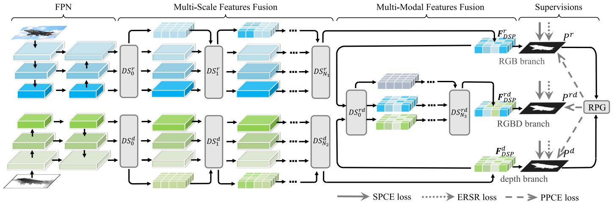

Code release for the TPAMI 2023 paper "Robust Perception and Precise Segmentation for Scribble-Supervised RGB-D Saliency Detection" by Long Li, Junwei Han, Nian Liu*, Salman Khan, Hisham Cholakkal, Rao Muhammad Anwer, and Fahad Shahbaz Khan.



## Code Construction Explanation
This paper involves three main models: our FPN-based (**Ours_FPN**) and HRNet-based (**Ours_HRNet**) models trained on our NNDR dataset, as well as our FPN-based model (**Ours_FPN_Xu**) trained on Xu's dataset. These three models share a common framework but have different hyperparameters. Thus, we prepared three separate projects for each model in this repository to facilitate  the use of our code. 

## Abstract
This paper proposes a scribble-based weakly supervised RGB-D salient object detection (SOD) method to relieve the annotation burden from pixel-wise annotations. In view of
the ensuing performance drop, we summarize two natural deficiencies of the scribbles and try to alleviate them, which are the weak richness of the pixel training samples (WRPS) and the poor structural integrity of the salient objects (PSIO). WRPS hinders robust saliency perception learning, which can be alleviated via model design for robust feature learning and pseudo-label generation for training sample enrichment. Specifically, we first design a dynamic searching process module as a meta operation to conduct multi-scale and multi-modal feature fusion for the robust RGB-D SOD model construction. Then, a dual-branch consistency learning mechanism is proposed to generate enough pixel training samples for robust saliency perception learning. PSIO makes direct structural learning infeasible since scribbles can not provide integral structural supervision. Thus, we propose an edge-region structure-refinement loss to recover the structural information and make precise segmentation. We deploy all components and conduct ablation studies on two baselines to validate their effectiveness and generalizability. Experimental results on eight datasets show that our method outperforms other scribble-based SOD models and achieves comparable performance with fully supervised state-of-the-art methods.

## Environment Configuration
- Linux with Python ≥ 3.6
- PyTorch ≥ 1.7 and [torchvision](https://github.com/pytorch/vision/) that matches the PyTorch installation.
  Install them together at [pytorch.org](https://pytorch.org) to make sure of this. Note, please check
  PyTorch version matches that is required by Detectron2.
- Detectron2: follow [Detectron2 installation instructions](https://detectron2.readthedocs.io/tutorials/install.html).
- OpenCV is optional but needed by demo and visualization
- `pip install -r requirements.txt`

## Data Preparation
Download the dataset from [Train/Train_Xu/Test](https://drive.google.com/drive/folders/1mZ1f6PTLY4UVP9kttgd5f6BXM_hlCtIo?usp=sharing) and unzip them to '.data'. Then the structure of the './data' folder will show as following:
````
-- dataset
   |-- test
   |   |-- | Test
   |   |-- |-- | DUTLF-Depth
   |   |-- |-- |-- | depth
   |   |-- |-- |-- | GT
   |   |-- |-- |-- | RGB
   |   |-- |-- | LFSD
   |   |-- |-- |-- | depth
   |   |-- |-- |-- | GT
   |   |-- |-- |-- | RGB
   ...

   |-- | DUTLF-Depth.txt
   |-- | LFSD.txt
   ...

   |-- train
   |   |-- | Train/Train_Xu
   |   |-- |-- | depth
   |   |-- |-- | gt
   |   |-- |-- | mask
   |   |-- |-- | RGB
   |   |-- | train_list.txt/train_list_xu.txt
````

## Training model
1. Run `python train.py` of the corresponding model directory. 
2. The trained models with satisfactory performance will be saved in `./checkpoint`

## Testing model
1. Download our trained model from [checkpoint](https://drive.google.com/drive/folders/1b-kwKBtw9RRvXlZvpZklxdNqsdzGgHe9?usp=sharing) and put it into `./checkpoint` folder.
2. Run `python test.py`.
3. The prediction images will be saved in `./predictions`. 

## Evaluation
We use a Matlab code for evaluation. It's provided in './evaluation'. To run this code, you should edit the `./evaluation/toolbox/getSODatasetInfo.m` file to set the test data directory. Then, you should edit the `./evaluation/evaluate.m` file to set the prediction data directory in the variable `salMapRootDir`. Finally, you can conduct the evaluation by run `cd ./evaluation; matlab -nodesktop -nosplash -r "evaluate('$model_name');quit"`.

## Result
You can download the saliency maps of our models  (**Ours_FPN**, **Ours_HRNet**, **Ours_FPN_Xu**) and other models (**DENet-N**, **WSSA**, **SCWS**) that were trained on our dataset from [saliency maps](https://drive.google.com/drive/folders/1mpPVDuke88qxtuC47OgLCsLwpx-gqSKK?usp=sharing).


